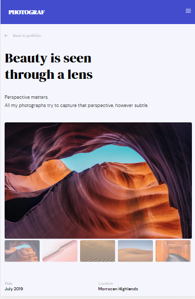

# Front-end final mockup-to-website project

## Design

You can see the live app [here](https://front-end-final-peta.netlify.app/)

## Feature


## Built With
- [HTML](https://www.w3schools.com/html/html_basic.asp)
- [SCSS](https://sass-lang.com/guide)
- [Vanilla Javascript](https://developer.mozilla.org/en-US/docs/Web/JavaScript)

## Design

We can follow the design on figma:

- online at [figma.com/Laaqiq-1-Portfolio-detail-Responsive](https://www.figma.com/file/VgF87mULloYb7HZ1EMCRzU/Laaqiq-1-Portfolio-detail-Responsive?node-id=0%3A1) (Recommended)
- by importing the `.fig` file in [the `source_materials` folder](./source_materials/) into your figma app.

### How To Use

To clone and run this application, you'll need [Git](https://git-scm.com) and [Node.js](https://
nodejs.org/en/download/) (which comes with [npm](http://npmjs.com)) installed on your computer. 
From your command line:
```bash
# Clone this repository
$ git clone https://github.com/Tiaraha-funny/photograph-gallery.git
# Install dependencies
$ npm install
# Run the app
$ npm start

```

## **Contact**
-   Email [@my-email-adress](mailto:peta.jea@onja.org)
